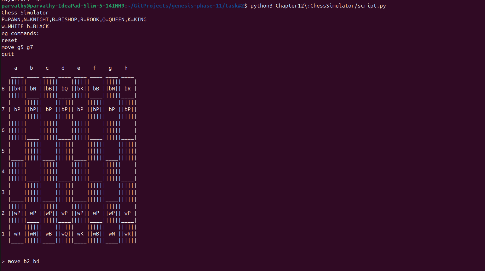
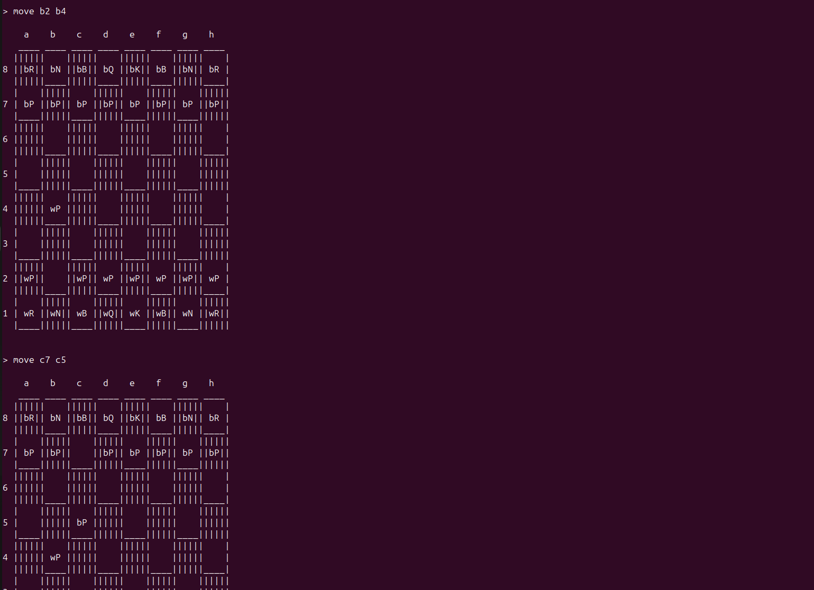
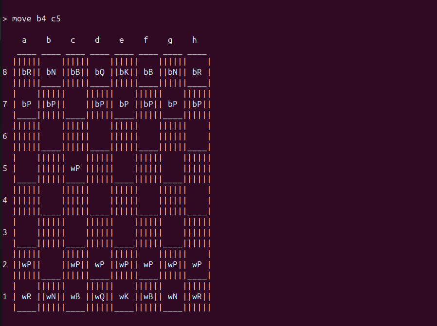

# CHESS SIMULATOR
An interactive python chess terminal game from chapter 7 that is added to the PATH folder and used as "chessgame".
## Topics
- Dictionaries
- Python Auttomation script
## Working

